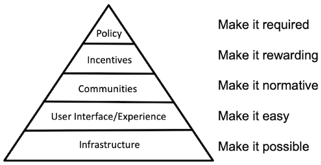

Open Science[^1] (OS) encompasses a large and ever growing [set of practices](https://www.fosteropenscience.eu/themes/fosterstrap/images/taxonomies/os_taxonomy.png) that make scholarly output (publications, data, code, protocols, etc.) more accessible, transparent, reliable, and inclusive. The rationale behind any of these practices is that [openness increases the quality, efficiency, and impact of science](https://doi.org/10.3390/publications7030046). While some of these practices are starting to become more widespread (e.g., Open Access publishing), others are far from being mainstream (e.g., open data and preprints). If you are reading this Starter Kit, you are probably aware of many of such practices and are convinced that OS is beneficial to science and society. So are we!

At first glance, the transition to OS may seem rather easy to accomplish. Why would people not embrace this great new set of practices? In reality, it requires nothing less than a profound cultural shift in academia. As articulated by Brian Nosek in [this blog post](https://cos.io/blog/strategy-culture-change/), a culture change needs a set of key ingredients that can be represented as a pyramid (*Figure 1*).

[^1]: The term "science" is used here in its broadest sense and includes fields such as the humanities, social sciences and engineering; that is, it more suitably refers to any form of scholarship. 